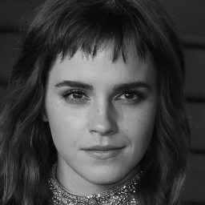
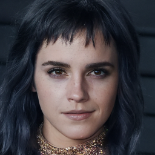
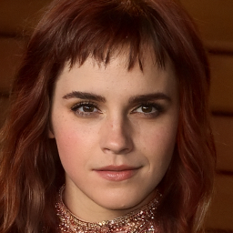

# MCG-ipynb
Unofficial implementation for inpainting and colorization experiments from the paper 'Improving Diffusion Models for Inverse Problems using Manifold Constraints'

# Usage

To use these notebooks, first clone [ilvr_adm](https://github.com/jychoi118/ilvr_adm) repo and download pre-trained unconditional models using [FFHQ](https://drive.google.com/file/d/117Y6Z6-Hg6TMZVIXMmgYbpZy7QvTXign/view?usp=sharing), then move these two notebooks into `ilvr_adm` folder and move `ffhq_10m.pt` into the path `./ilvr_adm/models`.

In both notebooks, `reconstruct_vanilla` implement the imputation process discussed in the Score-SDE paper [1], while `reconstruct_mcg` refers to Manifold Constrained Gradient (MCG) method [2].

# Results:

Grey:

Colorized using Score-SDE:

Colorized using MCG:

*I also did some audio spectral inpainting experiments in mel-scale trained with GradTTS backbones and Score-SDE based method:

Original mel-spectrogram:

Inpainted mel-spectrogram:

Recovered mel-spectrogram:

# Reference
[1] Song, Yang, et al. "Score-Based Generative Modeling through Stochastic Differential Equations." International Conference on Learning Representations. 2021.
[2] Chung, Hyungjin, et al. "Improving Diffusion Models for Inverse Problems using Manifold Constraints." arXiv preprint arXiv:2206.00941 (2022).